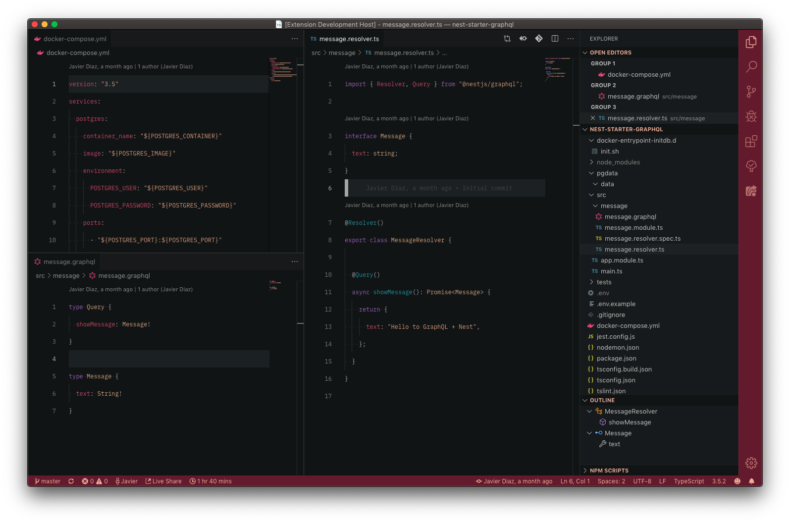

# [Yell Theme ✨](https://github.com/coderdiaz/yell-vscode-theme) &middot; [](https://marketplace.visualstudio.com/items?itemName=coderdiaz.yell) &middot; [](https://marketplace.visualstudio.com/items?itemName=coderdiaz.yell)
A Visual Studio Code theme for dark lovers with accesible colors ✨

About this theme, Thanks to Sarah Drasner (@sdras) for the tips and recommendations. This theme was created with help Sarah's article in CSS Tricks.

## Preview


## Installation
1. Install [Visual Studio Code](https://code.visualstudio.com/).
2. Launch Visual Studio Code.
3. Choose **Extensions** from menu.
4. Search for `yell`.
5. Click **Install** to install it.
6. Click **Reload** to reload the Code editor.
7. From the menu bar click: Code > Preferences > Color Themes > **Yell**.

## Preferences shown in the preview
The font in the preview image is Perplexed Font derivative of IBM Plex Mono, [available here](https://github.com/phoikoi/perplexed). Editor settings to activate font ligatures:
```
"editor.fontFamily": "Perplexed",
"editor.fontLigatures": true,
```

## Misc
This is my first theme, so if you something amiss, please feel free to file and issue! I'm sure there are things I missed. 

Any relevant changes for each version are documented in the changelog. Please update and check the changelog before filing any issues, as they may have already been taken care of.

This theme was inspired from favorite color palette used in my personal [portfolio](https://coderdiaz.me).